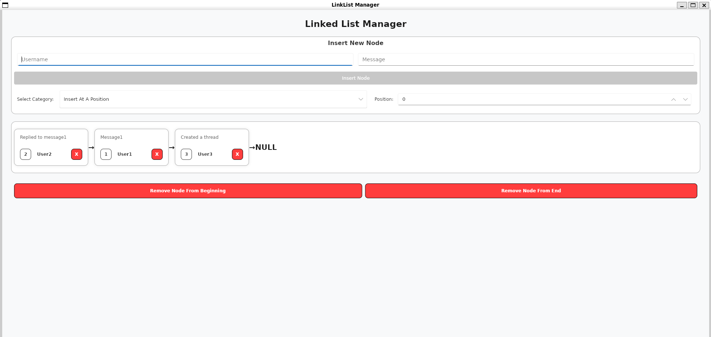

# Linked List Manager (C++ With UI)

A modern, visual demonstration of the Linked List data structure. This project combines low-level C++ memory management with a reactive GUI built using the [Slint](https://slint.dev/) UI framework.



## 🚀 Features
- **Visual List Representation**: Real-time rendering of the linked list nodes and pointers.
- **Dynamic Operations**:
  - Insert at Beginning, End, or Specific Position.
  - Remove from Beginning, End, or Specific Position.
  - Interactive "X" button on each node for direct deletion.
- **Modern C++ Core**: Implements RAII (Resource Acquisition Is Initialization) to ensure zero memory leaks.
- **Cross-Platform**: Built with CMake, supporting Windows, macOS, and Linux.

## 🛠️ Tech Stack
- **Language**: C++20
- **UI Framework**: Slint
- **Build System**: CMake 3.28+
- **Paradigm**: Object-Oriented Programming (OOP) with Templates.

## 📥 Getting Started

### Prerequisites
1. **C++ Compiler**: GCC, Clang, or MSVC (supporting C++20).
2. **CMake**: Version 3.28 or higher.
3. **Slint Compiler**: Follow the [Slint Installation Guide](https://slint.dev/docs/cpp/getting_started).

### Build & Run
```bash
# 1. Clone the repository
git clone https://github.com/yourusername/LinkList_Application_Demo.git
cd LinkList_Application_Demo

# 2. Create build directory
mkdir build && cd build

# 3. Configure and build
cmake ..
cmake --build .

# 4. Run the application
./linklist_project
```

## 🧠 Learning Journey

- **Memory Management**: Implementing a Destructor and the "Rule of Three" was pivotal to preventing leaks.
- **Template Programming**: Creating a generic `LinkList<T>` that can handle any data type.
- **Bridge Logic**: Connecting a procedural C++ backend to a reactive, declarative UI (Slint).

## 📈 Future Improvements
- [ ] **Iterators**: Add `begin()` and `end()` support to make the list compatible with C++ Standard Library algorithms.
- [ ] **Doubly Linked List**: Upgrade the structure to allow bidirectional traversal.
- [ ] **Persistence**: Add the ability to save/load the list data to a JSON or CSV file.
- [ ] **Search & Sort**: Implement search functionality and sorting algorithms (like Merge Sort) directly on the list.

---
*Created as part of a personal exploration into Data Structures and Modern C++ Development.*
